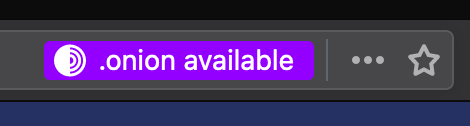

<h1 align="center">
    
</h1>

# Onion Location for Shopware 5

Do you want to provide your customers with an additional layer of privacy? A hidden service may help you with that!

This plugin implements the [onion-location meta tag](https://community.torproject.org/onion-services/advanced/onion-location/#using-an-html-<meta>-attribute) into your frontend.

Customers are now notified that there is a hidden service available if they connect via the tor network.



You can find the Shopware 6 equivalent [here](https://github.com/Family-Office-Company/FamilyOfficeOnionLocation).

## Usage requirements

<p float="left">
    <a href="http://shopware.com"></a>
</p>

## Development requirements

<p float="left">
    <a href="https://git-scm.com"></a>
    <a href="https://cmake.org"></a>
    <a href="https://www.docker.com"></a>
</p>

## Usage

Install and activate the plugin in your Shopware instance.

```
composer require family-office/onion-location5
```

```
bin/console plugin:refresh && bin/console plugin:install FamilyOfficeOnionLocation5 --activate
```

The only thing that's left to do for the plugin to work is to link your shops hidden service via the plugin configuration.

## Development

Clone the project into your Shopware installation

```shell
git clone git@github.com:Family-Office-Company/FamilyOfficeOnionLocation5.git
```

```shell
cd FamilyOfficeOnionLocation5
```

Install the development dependencies

```shell
make install
```

..and start developing! 🥳

## License

This project is licensed under the [MIT](LICENSE) license.  
Feel free to do whatever you want with the code!
